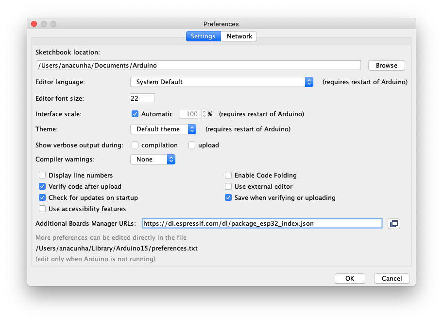
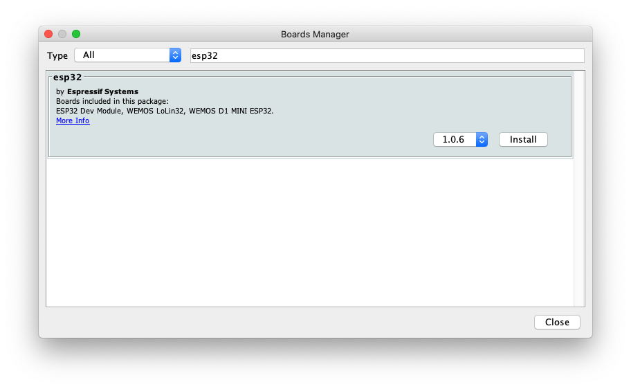
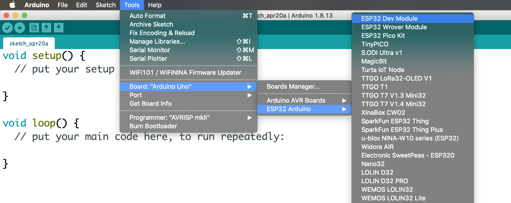
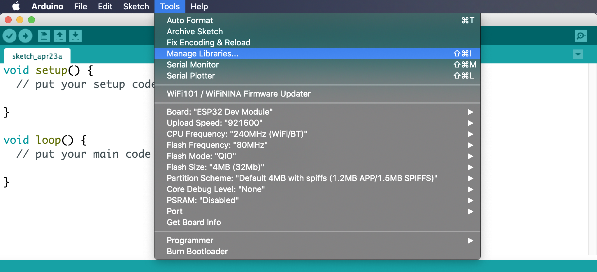
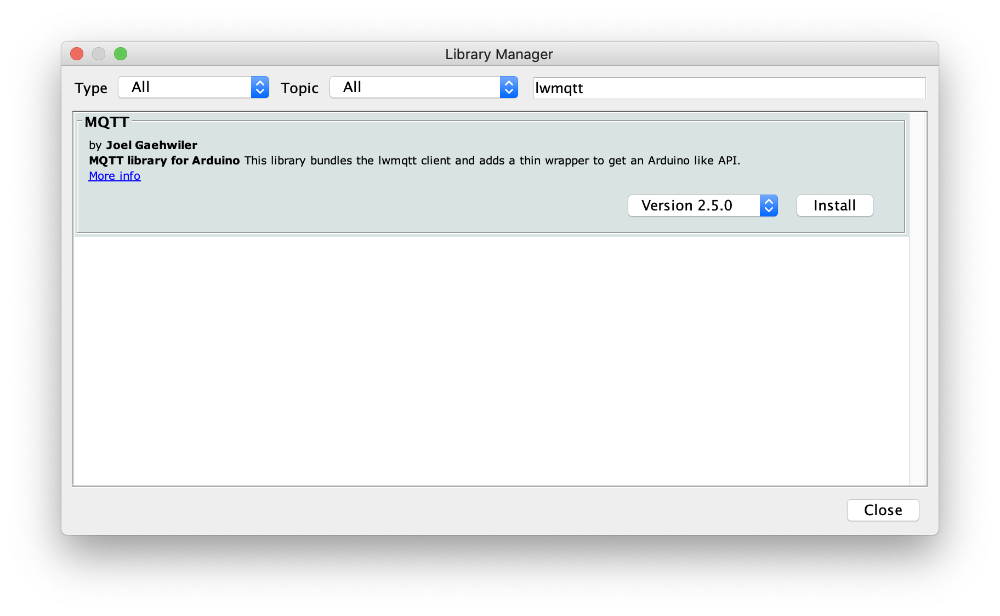
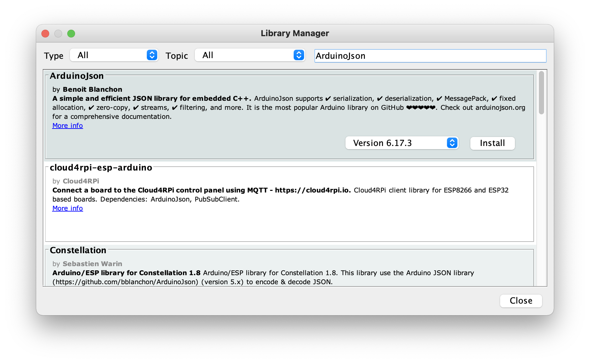
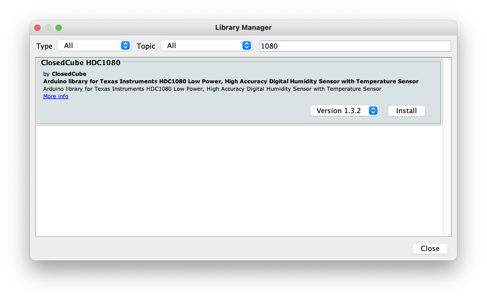

# Let's Build on AWS – IoT

## Setup

### Arduino IDE

Download install Arduino IDE: https://www.arduino.cc/en/software

### ESP32 Support for Arduino

1. Launch Arduino IDE
2. Open Preferences
3. Enter `https://dl.espressif.com/dl/package_esp32_index.json` into *Additional Boards Manager URLs* field
4. Click the *OK* button 
5. Go to Tools > Board > Boards Manager Manager...
6. Search for *esp32*
7. Install *esp32* by **Espressif Systems** 
8. Go to Tools > Board > ESP32 Arduino and select *ESP32 Dev Module* 

### Additional Libraries

Some of the sample code will require additional libraries. You can install them through the Arduino IDE Library Manager:

- Launch Arduino IDE
- Go to Tools > Manage Libraries... to open the Library Manager 

#### MQTT

- Search for *lwmqtt*
- Install [*MQTT*](https://github.com/256dpi/arduino-mqtt) by **Joel Gahwiler** 

#### ArduinoJson

- Search for *ArduinoJson*
- Install [*ArduinoJson*](https://github.com/bblanchon/ArduinoJson) by **Benoit Blanchon** 

#### ClosedCube HDC1080

- Search for *1080*
- Install [*ClosedCube HDC1080*](https://github.com/closedcube/ClosedCube_HDC1080_Arduino) by **ClosedCube** 

## Security

See [CONTRIBUTING](CONTRIBUTING.md#security-issue-notifications) for more information.

## License

This library is licensed under the MIT-0 License. See the LICENSE file.

